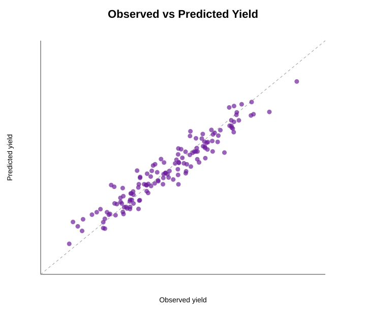

# AI-Assisted Breeding Selection in Python


A reproducible demonstration workflow for AI-assisted plant breeding selection using synthetic marker and phenotype data.

This repository does **not** claim that real genomic-selection research has been conducted. It is a transparent portfolio example showing how marker-style data, phenotype summaries, prediction models, cross-validation, marker-effect inspection, and selection-index ranking can be organized for crop-improvement decision support.

## Why this repository exists

AI-assisted breeding roles often require a researcher to understand both crop-improvement objectives and data-driven prediction workflows. This repository demonstrates:

- synthetic marker-matrix generation
- synthetic multi-trait breeding phenotype generation
- genotype-level train/test cross-validation
- ridge-regression prediction using marker data
- prediction of yield, disease score, maturity, and vigor
- transparent marker-effect ranking
- selection-index ranking of candidate genotypes
- model-card reporting and limitation statements

## Repository structure

```text
ai-assisted-breeding-selection-python/
├── data/
│   ├── synthetic_breeding_phenotypes.csv
│   └── synthetic_marker_matrix.csv
├── docs/
│   └── model_card.md
├── outputs/
│   ├── cross_validation_metrics.csv
│   ├── marker_effects_yield.csv
│   ├── marker_effects_yield.svg
│   ├── observed_vs_predicted_yield.svg
│   ├── predicted_breeding_values.csv
│   ├── selection_index_bar.svg
│   └── top_selection_candidates.csv
├── reports/
│   └── ai_breeding_selection_report.md
├── scripts/
│   └── ai_breeding_selection_workflow.py
├── LICENSE
└── README.md
```

## What the workflow does

1. Simulates marker data for experimental breeding lines.
2. Simulates genotype-level trait means for yield, disease, maturity, and vigor.
3. Fits ridge-regression models using marker predictors.
4. Evaluates prediction by genotype-level cross-validation.
5. Trains final models and predicts trait values for all genotypes.
6. Builds a transparent AI-assisted selection index.
7. Exports ranked candidate genotypes and marker-effect summaries.

## How to run

```bash
python scripts/ai_breeding_selection_workflow.py
```

Only Python and NumPy are required.

## Example outputs



## Result snapshot

Five-fold genotype-level cross-validation:

| Trait | RMSE | MAE | R² | Correlation |
|---|---:|---:|---:|---:|
| yield | 0.7175 | 0.5666 | 0.6872 | 0.8297 |
| disease score | 0.4807 | 0.3942 | 0.4973 | 0.7116 |
| days to maturity | 1.3997 | 1.1291 | 0.5607 | 0.7583 |
| vigor score | 0.3669 | 0.2988 | 0.6176 | 0.7876 |

Top ranked synthetic candidates:

| Rank | Genotype | Selection index | Predicted yield |
|---:|---|---:|---:|
| 1 | AIBREED_G062 | 0.8367 | 26.266 |
| 2 | AIBREED_G003 | 0.8287 | 27.103 |
| 3 | AIBREED_G017 | 0.7519 | 25.777 |

## What this demonstrates for postdoctoral roles

This repository is designed to show readiness for AI-assisted breeding and quantitative crop-improvement roles where the researcher must:

- connect genotype/marker-style data with crop-performance traits
- evaluate prediction models by genotype-level cross-validation
- combine multiple traits into a transparent selection index
- report model limitations clearly before making breeding decisions

## Background references

- Machine learning for genomic prediction: [A review of machine learning models applied to genomic prediction](https://pmc.ncbi.nlm.nih.gov/articles/PMC10516561/)
- Genomic prediction and AI methods in plant breeding: [Genomic prediction of plant traits by popular machine learning approaches](https://pmc.ncbi.nlm.nih.gov/articles/PMC12183563/)

## Important limitation

This is a synthetic demonstration. It should be interpreted as evidence of workflow thinking, reproducible coding, and AI-assisted breeding awareness — not as a real genomic-selection study or cultivar recommendation.

## Author

Mokkala Siva Prasad  
Vegetable Science | Plant Breeding | Field Phenotyping | AI-supported Crop Improvement  
GitHub: https://github.com/Siva-ghub5123
